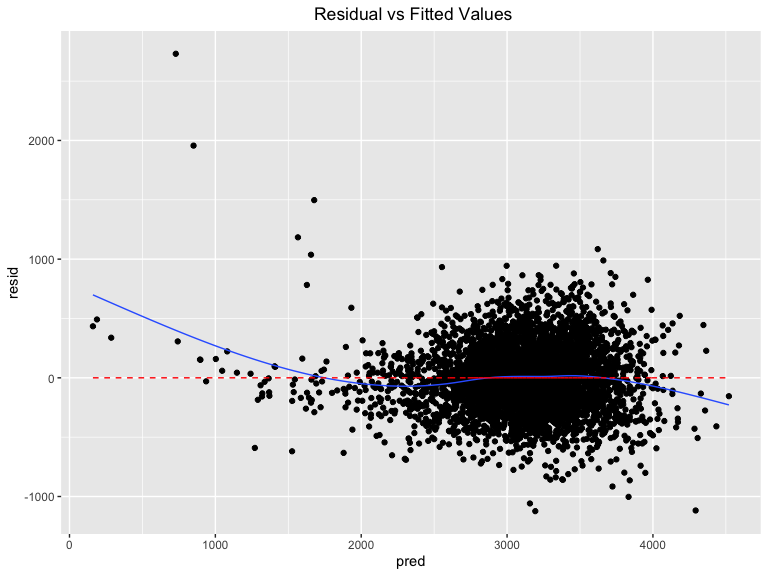

P8105\_hw5\_yc384
================
Ying Chen (UNI: yc384)
11/5/2019

## Problem 1: Understand the effects of several variables on a child’s birthweight.

#### Step 1: Load data

``` r
# read in data
birthweight = 
  read_csv("./data/birthweight.csv", col_names = TRUE)%>% 
  janitor::clean_names() 

head(birthweight, 3)
```

    ## # A tibble: 3 x 20
    ##   babysex bhead blength   bwt delwt fincome frace gaweeks malform menarche
    ##     <dbl> <dbl>   <dbl> <dbl> <dbl>   <dbl> <dbl>   <dbl>   <dbl>    <dbl>
    ## 1       2    34      51  3629   177      35     1    39.9       0       13
    ## 2       1    34      48  3062   156      65     2    25.9       0       14
    ## 3       2    36      50  3345   148      85     1    39.9       0       12
    ## # … with 10 more variables: mheight <dbl>, momage <dbl>, mrace <dbl>,
    ## #   parity <dbl>, pnumlbw <dbl>, pnumsga <dbl>, ppbmi <dbl>, ppwt <dbl>,
    ## #   smoken <dbl>, wtgain <dbl>

``` r
tail(birthweight, 3)
```

    ## # A tibble: 3 x 20
    ##   babysex bhead blength   bwt delwt fincome frace gaweeks malform menarche
    ##     <dbl> <dbl>   <dbl> <dbl> <dbl>   <dbl> <dbl>   <dbl>   <dbl>    <dbl>
    ## 1       1    35      52  3090   128      15     2    38.1       0       14
    ## 2       2    32      46  2268   120       5     2    39         0       13
    ## 3       2    34      52  3232   149      25     2    40.6       0       11
    ## # … with 10 more variables: mheight <dbl>, momage <dbl>, mrace <dbl>,
    ## #   parity <dbl>, pnumlbw <dbl>, pnumsga <dbl>, ppbmi <dbl>, ppwt <dbl>,
    ## #   smoken <dbl>, wtgain <dbl>

#### Step 2: EDA

``` r
str(birthweight)
```

    ## Classes 'spec_tbl_df', 'tbl_df', 'tbl' and 'data.frame': 4342 obs. of  20 variables:
    ##  $ babysex : num  2 1 2 1 2 1 2 2 1 1 ...
    ##  $ bhead   : num  34 34 36 34 34 33 33 33 36 33 ...
    ##  $ blength : num  51 48 50 52 52 52 46 49 52 50 ...
    ##  $ bwt     : num  3629 3062 3345 3062 3374 ...
    ##  $ delwt   : num  177 156 148 157 156 129 126 140 146 169 ...
    ##  $ fincome : num  35 65 85 55 5 55 96 5 85 75 ...
    ##  $ frace   : num  1 2 1 1 1 1 2 1 1 2 ...
    ##  $ gaweeks : num  39.9 25.9 39.9 40 41.6 ...
    ##  $ malform : num  0 0 0 0 0 0 0 0 0 0 ...
    ##  $ menarche: num  13 14 12 14 13 12 14 12 11 12 ...
    ##  $ mheight : num  63 65 64 64 66 66 72 62 61 64 ...
    ##  $ momage  : num  36 25 29 18 20 23 29 19 13 19 ...
    ##  $ mrace   : num  1 2 1 1 1 1 2 1 1 2 ...
    ##  $ parity  : num  3 0 0 0 0 0 0 0 0 0 ...
    ##  $ pnumlbw : num  0 0 0 0 0 0 0 0 0 0 ...
    ##  $ pnumsga : num  0 0 0 0 0 0 0 0 0 0 ...
    ##  $ ppbmi   : num  26.3 21.3 23.6 21.8 21 ...
    ##  $ ppwt    : num  148 128 137 127 130 115 105 119 105 145 ...
    ##  $ smoken  : num  0 0 1 10 1 0 0 0 0 4 ...
    ##  $ wtgain  : num  29 28 11 30 26 14 21 21 41 24 ...
    ##  - attr(*, "spec")=
    ##   .. cols(
    ##   ..   babysex = col_double(),
    ##   ..   bhead = col_double(),
    ##   ..   blength = col_double(),
    ##   ..   bwt = col_double(),
    ##   ..   delwt = col_double(),
    ##   ..   fincome = col_double(),
    ##   ..   frace = col_double(),
    ##   ..   gaweeks = col_double(),
    ##   ..   malform = col_double(),
    ##   ..   menarche = col_double(),
    ##   ..   mheight = col_double(),
    ##   ..   momage = col_double(),
    ##   ..   mrace = col_double(),
    ##   ..   parity = col_double(),
    ##   ..   pnumlbw = col_double(),
    ##   ..   pnumsga = col_double(),
    ##   ..   ppbmi = col_double(),
    ##   ..   ppwt = col_double(),
    ##   ..   smoken = col_double(),
    ##   ..   wtgain = col_double()
    ##   .. )

``` r
summary(birthweight)
```

    ##     babysex          bhead          blength           bwt      
    ##  Min.   :1.000   Min.   :21.00   Min.   :20.00   Min.   : 595  
    ##  1st Qu.:1.000   1st Qu.:33.00   1st Qu.:48.00   1st Qu.:2807  
    ##  Median :1.000   Median :34.00   Median :50.00   Median :3132  
    ##  Mean   :1.486   Mean   :33.65   Mean   :49.75   Mean   :3114  
    ##  3rd Qu.:2.000   3rd Qu.:35.00   3rd Qu.:51.00   3rd Qu.:3459  
    ##  Max.   :2.000   Max.   :41.00   Max.   :63.00   Max.   :4791  
    ##      delwt          fincome          frace          gaweeks     
    ##  Min.   : 86.0   Min.   : 0.00   Min.   :1.000   Min.   :17.70  
    ##  1st Qu.:131.0   1st Qu.:25.00   1st Qu.:1.000   1st Qu.:38.30  
    ##  Median :143.0   Median :35.00   Median :2.000   Median :39.90  
    ##  Mean   :145.6   Mean   :44.11   Mean   :1.655   Mean   :39.43  
    ##  3rd Qu.:157.0   3rd Qu.:65.00   3rd Qu.:2.000   3rd Qu.:41.10  
    ##  Max.   :334.0   Max.   :96.00   Max.   :8.000   Max.   :51.30  
    ##     malform            menarche        mheight          momage    
    ##  Min.   :0.000000   Min.   : 0.00   Min.   :48.00   Min.   :12.0  
    ##  1st Qu.:0.000000   1st Qu.:12.00   1st Qu.:62.00   1st Qu.:18.0  
    ##  Median :0.000000   Median :12.00   Median :63.00   Median :20.0  
    ##  Mean   :0.003455   Mean   :12.51   Mean   :63.49   Mean   :20.3  
    ##  3rd Qu.:0.000000   3rd Qu.:13.00   3rd Qu.:65.00   3rd Qu.:22.0  
    ##  Max.   :1.000000   Max.   :19.00   Max.   :77.00   Max.   :44.0  
    ##      mrace           parity            pnumlbw     pnumsga 
    ##  Min.   :1.000   Min.   :0.000000   Min.   :0   Min.   :0  
    ##  1st Qu.:1.000   1st Qu.:0.000000   1st Qu.:0   1st Qu.:0  
    ##  Median :2.000   Median :0.000000   Median :0   Median :0  
    ##  Mean   :1.627   Mean   :0.002303   Mean   :0   Mean   :0  
    ##  3rd Qu.:2.000   3rd Qu.:0.000000   3rd Qu.:0   3rd Qu.:0  
    ##  Max.   :4.000   Max.   :6.000000   Max.   :0   Max.   :0  
    ##      ppbmi            ppwt           smoken           wtgain      
    ##  Min.   :13.07   Min.   : 70.0   Min.   : 0.000   Min.   :-46.00  
    ##  1st Qu.:19.53   1st Qu.:110.0   1st Qu.: 0.000   1st Qu.: 15.00  
    ##  Median :21.03   Median :120.0   Median : 0.000   Median : 22.00  
    ##  Mean   :21.57   Mean   :123.5   Mean   : 4.145   Mean   : 22.08  
    ##  3rd Qu.:22.91   3rd Qu.:134.0   3rd Qu.: 5.000   3rd Qu.: 28.00  
    ##  Max.   :46.10   Max.   :287.0   Max.   :60.000   Max.   : 89.00

``` r
skimr::skim(birthweight)
```

    ## Skim summary statistics
    ##  n obs: 4342 
    ##  n variables: 20 
    ## 
    ## ── Variable type:numeric ─────────────────────────────────────────────────────────
    ##  variable missing complete    n      mean      sd     p0     p25     p50
    ##   babysex       0     4342 4342    1.49     0.5     1       1       1   
    ##     bhead       0     4342 4342   33.65     1.62   21      33      34   
    ##   blength       0     4342 4342   49.75     2.72   20      48      50   
    ##       bwt       0     4342 4342 3114.4    512.15  595    2807    3132.5 
    ##     delwt       0     4342 4342  145.57    22.21   86     131     143   
    ##   fincome       0     4342 4342   44.11    25.98    0      25      35   
    ##     frace       0     4342 4342    1.66     0.85    1       1       2   
    ##   gaweeks       0     4342 4342   39.43     3.15   17.7    38.3    39.9 
    ##   malform       0     4342 4342    0.0035   0.059   0       0       0   
    ##  menarche       0     4342 4342   12.51     1.48    0      12      12   
    ##   mheight       0     4342 4342   63.49     2.66   48      62      63   
    ##    momage       0     4342 4342   20.3      3.88   12      18      20   
    ##     mrace       0     4342 4342    1.63     0.77    1       1       2   
    ##    parity       0     4342 4342    0.0023   0.1     0       0       0   
    ##   pnumlbw       0     4342 4342    0        0       0       0       0   
    ##   pnumsga       0     4342 4342    0        0       0       0       0   
    ##     ppbmi       0     4342 4342   21.57     3.18   13.07   19.53   21.03
    ##      ppwt       0     4342 4342  123.49    20.16   70     110     120   
    ##    smoken       0     4342 4342    4.15     7.41    0       0       0   
    ##    wtgain       0     4342 4342   22.08    10.94  -46      15      22   
    ##      p75   p100     hist
    ##     2       2   ▇▁▁▁▁▁▁▇
    ##    35      41   ▁▁▁▁▅▇▁▁
    ##    51      63   ▁▁▁▁▁▇▁▁
    ##  3459    4791   ▁▁▁▃▇▇▂▁
    ##   157     334   ▁▇▅▁▁▁▁▁
    ##    65      96   ▁▂▇▂▂▂▁▃
    ##     2       8   ▇▇▁▁▁▁▁▁
    ##    41.1    51.3 ▁▁▁▁▃▇▁▁
    ##     0       1   ▇▁▁▁▁▁▁▁
    ##    13      19   ▁▁▁▁▂▇▁▁
    ##    65      77   ▁▁▁▅▇▂▁▁
    ##    22      44   ▂▇▅▂▁▁▁▁
    ##     2       4   ▇▁▇▁▁▁▁▁
    ##     0       6   ▇▁▁▁▁▁▁▁
    ##     0       0   ▁▁▁▇▁▁▁▁
    ##     0       0   ▁▁▁▇▁▁▁▁
    ##    22.91   46.1 ▁▇▅▁▁▁▁▁
    ##   134     287   ▁▇▆▁▁▁▁▁
    ##     5      60   ▇▁▁▁▁▁▁▁
    ##    28      89   ▁▁▁▇▇▁▁▁

From the above summary, we can see that this data contains 4342
observatons and 20 variables. There are no missing data. We then start
tidying the data by converting numeirical variables to factor varaibles
for babysex, father’s race, mother’s race and malformation history.

Looking at variables: pnumlbw and pnumsga, summary shows 0 for all the
statistics, which indicate these two variables maynot have valid
information and we will exclude them from future analysis.

``` r
summary(birthweight$pnumlbw)
```

    ##    Min. 1st Qu.  Median    Mean 3rd Qu.    Max. 
    ##       0       0       0       0       0       0

``` r
summary(birthweight$pnumsga)
```

    ##    Min. 1st Qu.  Median    Mean 3rd Qu.    Max. 
    ##       0       0       0       0       0       0

#### Step 3: Tidy data

``` r
birthweight_tidy = 
  birthweight %>% 
  distinct(instacart) %>% 
  mutate(
    babysex = factor(babysex, levels = c(1, 2), 
                     labels = c("male", "female")),
    frace = factor(frace, levels = c(1, 2, 3, 4, 8, 9), 
                   labels = c("white", "black", "asian", "puerto rican", "other", "unknown")),
    mrace = factor(mrace, levels = c(1, 2, 3, 4, 8, 9), 
                   labels = c("white", "black", "asian", "puerto rican", "other", "unknown")),
    malform = factor(malform, levels = c(0, 1), 
                     labels = c("absent", "present"))                         
  )

head(birthweight_tidy, 3)
```

    ## # A tibble: 3 x 20
    ##   babysex bhead blength   bwt delwt fincome frace gaweeks malform menarche
    ##   <fct>   <dbl>   <dbl> <dbl> <dbl>   <dbl> <fct>   <dbl> <fct>      <dbl>
    ## 1 female     34      51  3629   177      35 white    39.9 absent        13
    ## 2 male       34      48  3062   156      65 black    25.9 absent        14
    ## 3 female     36      50  3345   148      85 white    39.9 absent        12
    ## # … with 10 more variables: mheight <dbl>, momage <dbl>, mrace <fct>,
    ## #   parity <dbl>, pnumlbw <dbl>, pnumsga <dbl>, ppbmi <dbl>, ppwt <dbl>,
    ## #   smoken <dbl>, wtgain <dbl>

#### Step 4: Fit a linear regression based on literature review for low birthweight.

My model will use birth weight (bwt) as the outcome variable and the
following variables as predictors: babysex, gestational age in weeks,
baby’s length at birth and average number of cigarettes smoked per day
during pregnancy.

``` r
bwt_lm = 
        birthweight_tidy %>% 
        lm(bwt ~ babysex + gaweeks + blength + smoken, data = .) 

summary(bwt_lm)
```

    ## 
    ## Call:
    ## lm(formula = bwt ~ babysex + gaweeks + blength + smoken, data = .)
    ## 
    ## Residuals:
    ##     Min      1Q  Median      3Q     Max 
    ## -1717.0  -216.1   -10.7   209.1  4135.1 
    ## 
    ## Coefficients:
    ##                 Estimate Std. Error t value Pr(>|t|)    
    ## (Intercept)   -4296.0991    98.8756 -43.450  < 2e-16 ***
    ## babysexfemale   -20.2852    10.1830  -1.992 0.046428 *  
    ## gaweeks          27.6832     1.7220  16.077  < 2e-16 ***
    ## blength         127.4313     2.0087  63.439  < 2e-16 ***
    ## smoken           -2.6190     0.6849  -3.824 0.000133 ***
    ## ---
    ## Signif. codes:  0 '***' 0.001 '**' 0.01 '*' 0.05 '.' 0.1 ' ' 1
    ## 
    ## Residual standard error: 332.6 on 4337 degrees of freedom
    ## Multiple R-squared:  0.5786, Adjusted R-squared:  0.5783 
    ## F-statistic:  1489 on 4 and 4337 DF,  p-value: < 2.2e-16

**Note:** From the model result, we can see that all the variables in my
model are significant predictors of low baby birth weight. However, sex
is very close to
0.05.

#### Step 5: Plot model residuals against fitted values use add\_predictions and add\_residuals

``` r
bwt_1 = modelr::add_residuals(birthweight_tidy, bwt_lm)
bwt_plot = modelr::add_predictions(bwt_1, bwt_lm)
bwt_plot %>%
  ggplot(aes(x = pred, y = resid)) +
  geom_point() +
  geom_smooth(se = F,size = 0.5) + 
  labs(title = " Residual vs Fitted Values") +
  theme(plot.title = element_text(hjust =.5)) +
  geom_line(aes(y = 0), color = "red", linetype = "dashed")
```

    ## `geom_smooth()` using method = 'gam' and formula 'y ~ s(x, bs = "cs")'



**Note:** From the above plot, we can see that my model fits the data
well. The residuals are around line 0 without any pattern. There are a
few points with large residuals that need to be investigated to see if
there are any data entry errors or any special cases.
